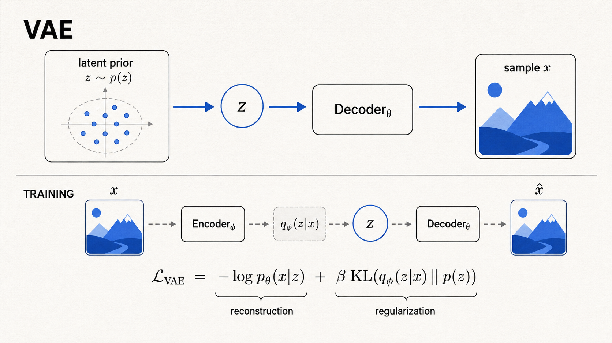
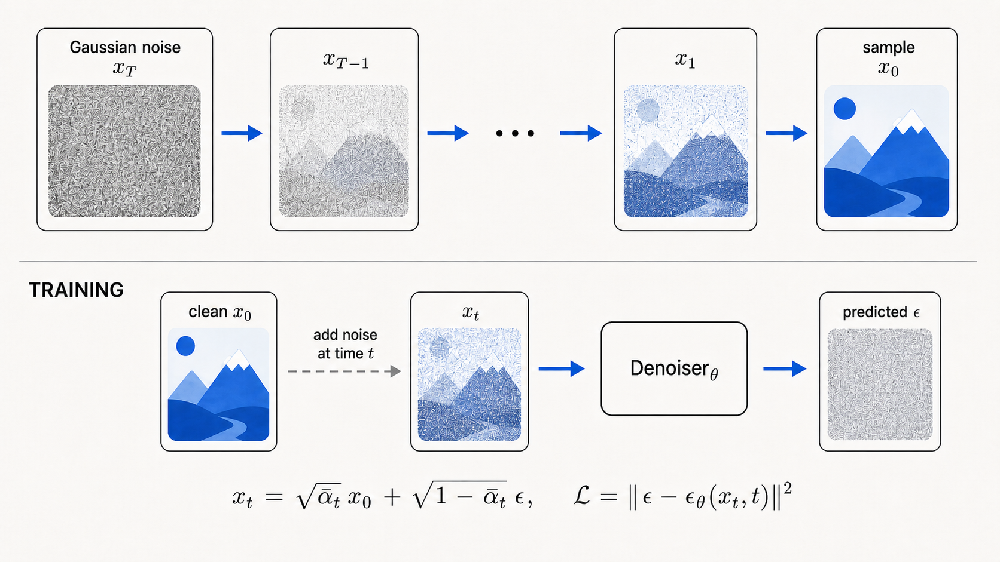
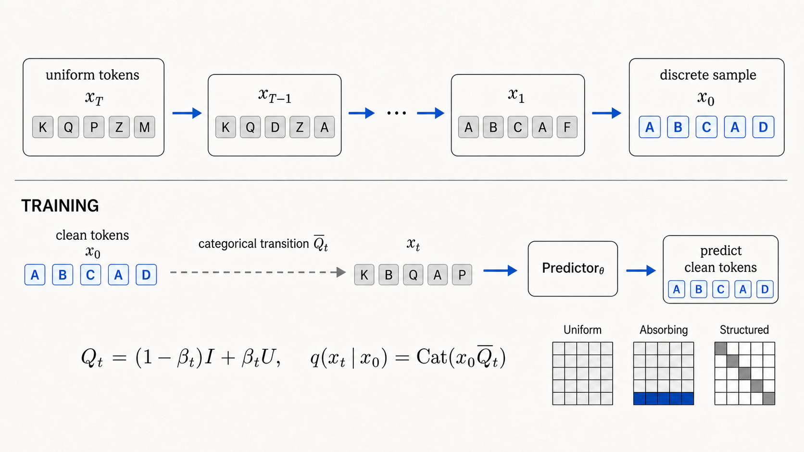
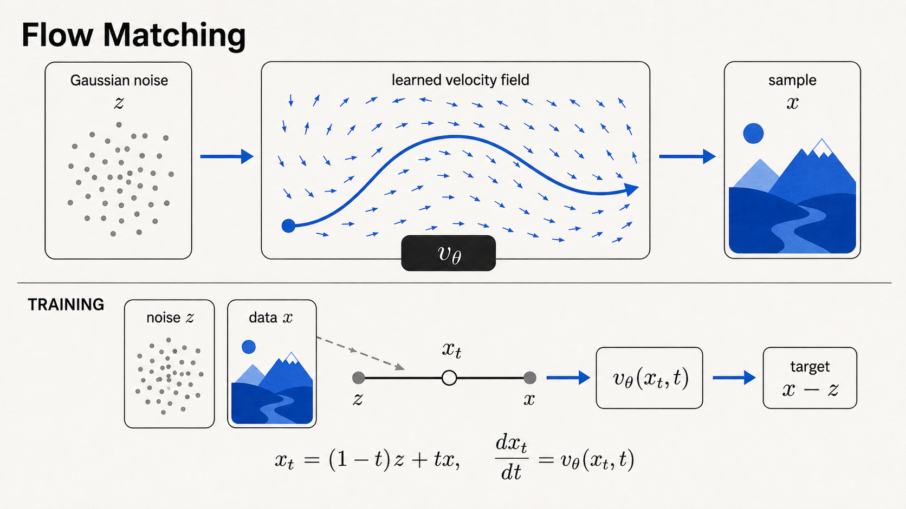

# Generative Models Lab

<p align="right">
<a href="README.md">English</a> | 中文
</p>

<p align="center">
  四个可以实际运行的生成模型项目，<br>
  从潜变量建模、连续与离散扩散，一直到概率流。
</p>

<p align="center">
  <a href="https://github.com/CHU-ZP/Modular-Vae"><strong>VAE</strong></a>
  &nbsp;·&nbsp;
  <a href="https://github.com/CHU-ZP/Modular-Diffusion"><strong>Diffusion</strong></a>
  &nbsp;·&nbsp;
  <a href="https://github.com/CHU-ZP/Discrete-Diffusion"><strong>Discrete Diffusion</strong></a>
  &nbsp;·&nbsp;
  <a href="https://github.com/CHU-ZP/FlowMatching"><strong>Flow Matching</strong></a>
</p>

Generative Models Lab 汇集了四类生成模型的实践。每个仓库都从直觉和公式讲起，再落到模块化的 PyTorch 代码，最后给出实际训练结果。读者可以顺着一条完整路径理解：模型为什么这样定义、训练目标从哪里来，以及采样时究竟发生了什么。

## 建议的阅读顺序

如果按 `01` 到 `04` 阅读，会先接触潜变量模型，再进入连续和离散的去噪过程，最后来到连续时间的分布搬运。当然，每个仓库都可以单独阅读，也可以直接跳到最感兴趣的方法。

| 顺序 | 项目 | 数据 | 学习对象 | 生成方式 |
| :---: | --- | --- | --- | --- |
| 01 | [**VAE**](https://github.com/CHU-ZP/Modular-Vae) | MNIST | 后验、先验和解码器 | 从先验采样潜变量，再解码成图像 |
| 02 | [**Diffusion**](https://github.com/CHU-ZP/Modular-Diffusion) | CIFAR10 像素与潜变量 | 噪声、原始数据或速度 | 逐步反转高斯加噪过程 |
| 03 | [**Discrete Diffusion**](https://github.com/CHU-ZP/Discrete-Diffusion) | 量化 MNIST 与二值 ModelNet10 体素 | 原始离散取值的概率 | 逐步反转类别转移过程 |
| 04 | [**Flow Matching**](https://github.com/CHU-ZP/FlowMatching) | CIFAR10 像素 | 连续速度场 | 从噪声出发求解 ODE，最终到达数据分布 |

## 探索四个项目

<table>
  <tr>
    <td width="50%" valign="top">
      <h3 align="center">01 · VAE</h3>
      <p align="center"><code>潜变量模型</code></p>
      <a href="https://github.com/CHU-ZP/Modular-Vae">
        
      </a>
      <p>先在低维潜空间中建立概率模型，再把采样得到的潜变量解码成数据。</p>
      <p align="center"><a href="https://github.com/CHU-ZP/Modular-Vae"><strong>查看 VAE →</strong></a></p>
    </td>
    <td width="50%" valign="top">
      <h3 align="center">02 · Diffusion</h3>
      <p align="center"><code>连续状态去噪</code></p>
      <a href="https://github.com/CHU-ZP/Modular-Diffusion">
        
      </a>
      <p>先规定数据怎样逐步变成高斯噪声，再学习如何沿相反方向一步步恢复数据。</p>
      <p align="center"><a href="https://github.com/CHU-ZP/Modular-Diffusion"><strong>查看 Diffusion →</strong></a></p>
    </td>
  </tr>
  <tr>
    <td width="50%" valign="top">
      <h3 align="center">03 · Discrete Diffusion</h3>
      <p align="center"><code>离散类别去噪</code></p>
      <a href="https://github.com/CHU-ZP/Discrete-Diffusion">
        
      </a>
      <p>用类别转移矩阵逐步扰乱数据，再在始终离散的状态空间中学习反向恢复。</p>
      <p align="center"><a href="https://github.com/CHU-ZP/Discrete-Diffusion"><strong>查看 Discrete Diffusion →</strong></a></p>
    </td>
    <td width="50%" valign="top">
      <h3 align="center">04 · Flow Matching</h3>
      <p align="center"><code>连续概率流</code></p>
      <a href="https://github.com/CHU-ZP/FlowMatching">
        
      </a>
      <p>学习一片连续速度场，让样本从简单噪声分布一路流向数据分布。</p>
      <p align="center"><a href="https://github.com/CHU-ZP/FlowMatching"><strong>查看 Flow Matching →</strong></a></p>
    </td>
  </tr>
</table>

## 四种方法有何不同

四种方法都要把简单分布变成数据分布，但它们选择的状态空间、训练信号和生成路径并不相同。

### 01 · VAE：在潜空间中建立概率模型

VAE 不把输入压缩成一个固定向量，而是让编码器给出潜变量的近似后验。重参数化技巧把随机性单独放进 `epsilon`，于是模型仍然可以通过采样过程反向传播：

```math
q_\phi(z\mid x)
=
\mathcal{N}\!\left(
z;\mu_\phi(x),\mathrm{diag}(\sigma_\phi^2(x))
\right),
\qquad
z=\mu_\phi(x)+\sigma_\phi(x)\odot\epsilon,
\quad
\epsilon\sim\mathcal{N}(0,I).
```

训练时最小化负 ELBO。重建项要求输出接近输入，KL 项则让各个样本的后验不要在潜空间中彼此散开：

```math
\mathcal{L}_{\mathrm{VAE}}
=
\mathbb{E}_{q_\phi(z\mid x)}[-\log p_\theta(x\mid z)]
+
\beta\,\mathrm{KL}\!\left(q_\phi(z\mid x)\Vert p(z)\right).
```

生成时不需要输入图像，只要从先验中采一个潜变量，再经过一次解码：

```math
z\sim p(z),
\qquad
x\sim p_\theta(x\mid z).
```

### 02 · Diffusion：从高斯噪声逐步去噪

扩散模型先规定一个固定的前向加噪过程。在任意时间步，都可以直接把干净数据与高斯噪声混合成 `x_t`：

```math
x_t
=
\sqrt{\bar\alpha_t}\,x_0
+
\sqrt{1-\bar\alpha_t}\,\epsilon,
\qquad
\epsilon\sim\mathcal{N}(0,I).
```

去噪网络可以预测噪声、原始数据或速度。最经典的做法是让它猜出加入 `x_t` 的那份噪声：

```math
\mathcal{L}_{\mathrm{diff}}
=
\mathbb{E}_{x_0,t,\epsilon}
\left[
\left\|\epsilon-\epsilon_\theta(x_t,t,c)\right\|^2
\right].
```

采样从高斯噪声开始，反复调用去噪网络。DDPM 的每一步都带有随机性；DDIM 则可以使用同一个网络，沿一条确定性轨迹更快地完成采样。

### 03 · Discrete Diffusion：始终留在离散状态空间

离散扩散不用高斯噪声，而是通过类别转移来破坏信息。每一步都根据转移矩阵决定保留还是替换某个离散取值：

```math
Q_t=(1-\beta_t)I+\beta_t U,
\qquad
\bar Q_t=Q_1Q_2\cdots Q_t,
\qquad
q(x_t\mid x_0)=\mathrm{Cat}(x_0\bar Q_t).
```

网络根据被扰乱的 `x_t`，直接预测原始离散取值的概率分布：

```math
p_\theta(x_0\mid x_t,t,y)
=
\mathrm{softmax}\!\left(f_\theta(x_t,t,y)\right).
```

生成从均匀类别噪声开始，每一步都把网络预测与精确的离散后验结合起来。整个过程中，像素始终是量化后的离散值，体素也始终只有空和占用两种状态。

### 04 · Flow Matching：沿连续速度场生成

Flow Matching 先在高斯噪声 `z` 和真实样本 `x` 之间规定一条概率路径。对于直线形式的 Rectified Flow，这条路径的速度可以直接写出：

```math
x_t=(1-t)z+tx,
\qquad
u_t=\frac{d x_t}{dt}=x-z.
```

训练时，让网络预测的速度尽量接近这条路径的真实速度：

```math
\mathcal{L}_{\mathrm{FM}}
=
\mathbb{E}_{x,z,t}
\left[
\left\|v_\theta(x_t,t)-(x-z)\right\|^2
\right].
```

生成时从噪声出发，使用 Euler 或 Heun 等数值方法求解 ODE，从 `t=0` 一路积分到 `t=1`：

```math
x_0\sim\mathcal{N}(0,I),
\qquad
\frac{d x_t}{dt}=v_\theta(x_t,t),
\qquad
t:0\rightarrow1.
```

## 每个仓库里有什么

四个仓库都尽量保留同样的阅读线索：

- 从直觉和公式出发的原理说明；
- 能和公式逐项对应的代码模块；
- 可以直接运行的配置、训练命令与采样命令；
- 真实的生成样本、量化结果和实现记录；
- 中英文两套文档。

选择上面的任意项目，就可以继续查看更完整的推导、代码和实验结果。
